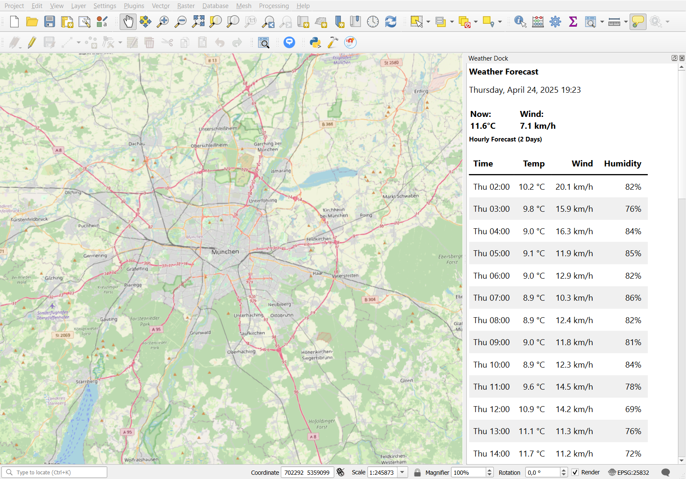

# Weather Dock QGIS Plugin

A QGIS plugin that displays current weather conditions and hourly forecasts for the center of the map canvas, using your local time zone.

## Features

- Displays current temperature and wind speed.
- Shows hourly forecast for temperature, wind speed, and **relative humidity**.
- **Displays all times in the user's local time zone.**
- **Configurable forecast duration (1 to 7 days) via a settings menu.**
- Updates automatically when the map canvas extent changes.
- Uses the free open-meteo.com weather API.
- Renders data in a clear HTML table within the dock widget.

## Requirements

- QGIS 3.34 or higher (or verify based on your target QGIS version)
- Internet connection to fetch weather data

## Installation

### From ZIP file

1. Download the ZIP file of the plugin.
2. Open QGIS.
3. Go to "Plugins" → "Manage and Install Plugins...".
4. Click on "Install from ZIP".
5. Browse to the downloaded ZIP file and click "Install Plugin".

### Manual Installation

1. Download or clone this repository.
2. Copy the entire `qgis_weather_dock` directory (the one containing `__init__.py`) to your QGIS plugin directory:
   - Windows: `C:\Users\{username}\AppData\Roaming\QGIS\QGIS3\profiles\default\python\plugins`
   - Linux: `~/.local/share/QGIS/QGIS3/profiles/default/python/plugins`
   - macOS: `~/Library/Application Support/QGIS/QGIS3/profiles/default/python/plugins`
3. Restart QGIS.
4. Enable the plugin ("Weather Dock") in the QGIS Plugin Manager ("Plugins" → "Manage and Install Plugins...").

## Usage

1. After installing and enabling the plugin, click on the Weather Dock icon in the plugin toolbar or select "Show Weather Dock" from the "Plugins" -> "Weather Dock" menu.
2. A dock widget will appear (usually on the right side) of the QGIS window.
3. The widget will display current weather information (temperature and wind) and an hourly forecast table for the center of your map canvas. All times shown are converted to your computer's local time zone.
4. As you pan and zoom the map, the weather information will update automatically for the new map center.
5. **To configure the forecast duration:** Go to the **Plugins -> Weather Dock -> Settings...** menu item. Select the desired number of days (1-7) and click OK. The weather display will refresh automatically with the new forecast length.

## Data Source

This plugin uses the free [Open-Meteo Weather API](https://open-meteo.com/), which provides:
- Current weather conditions
- Hourly forecasts
- No API key required
- Free for non-commercial use

## License

This plugin is licensed under the [GNU General Public License v3.0](LICENSE) (assuming you have a LICENSE file, otherwise state the license).

## Contributing

Contributions are welcome! Please feel free to submit a Pull Request.
